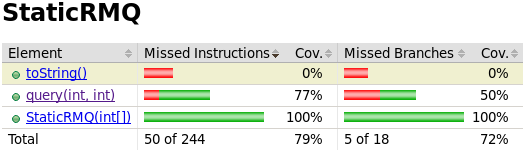
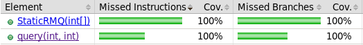

# Unit testing

For simple unit testing all that is needed are test classes like the ones above.

Typically one test class is created for each class to be tested and the test class name is `Test<ClassName>` where `<ClassName>` is the name of the class to be tested. It is also good practice to create test classes in a package structure that mirrors the original class structure. E.g. tests for the class

```java
src.main.java.rmq.domain.StaticRMQ
```
are in 
```java
src.test.java.rmq.domain.TestStaticRMQ
```

## Test file structure

The basic test file contents in java can be seen in [TestDynamicRMQ.java](src/test/java/rmq/domain/TestDynamicRMQ.java).

To be able to acces the class to test you will need to import the class package:

```java
import rmq.domain;
```

To actually run tests you will need to import Junit stuff:

```java
import static org.junit.Assert.*;
import org.junit.Test;
```

In the test class itself actual tests to run are annotated with `@Test`:

```java
@Test
public void testNothing() {
    assertTrue(true);
}
```

There are [other annotations](https://www.guru99.com/junit-annotations-api.html) that are useful as well but more on these later.

Assertions available through the `org.junit.Assert.*` import can be used to check for things. If the assertions fail, an exception will be thrown and the test in question will fail.

## Actual tests

When writing actual tests it is a good idea to write very small test cases and try to concentrate on testin small very particular parts first. For example the first test in `TestStaticRMQ` just checks that the data structure works for a very simple test case. No particular attention is paid to the test being thorough. The idea is just that if the entire class fails, then this test will fail and be a good startin point for debugging.

```java
    @Test
    public void tinyTest() {
        int[] arr = {4, 3, 2, 1};
        StaticRMQ rmq = new StaticRMQ(arr);
        assertEquals("Wrong minimum for whole array", 1, rmq.query(0, 3));
        assertEquals("Wrong minimum for first element", 4, rmq.query(0, 0));
    }
```
Note that with only this imple test, the test coverage for the class looks decent:



It is worth noting that coverage tools only check that lines were called during the running of tests. Coverage reports in general pay very little attention to trying to evaluate wether an existing covered section of code is covered well.

An attempt to resolve this is made in the next test. A lot of "random" calls to a structure build using a "random" array are made and checked against a known to work bruteforce solution. Note that a seed is used here for the random object. This ensures that a situation arising in a failing test can be recreated. This might be improved by usually using an unseeded random to seed a new random and in failing cases the seed used would be reported for reproducibility. This kind of testing would in time and multiple runs cover unforseen edge cases fairly well at the cost of complicating the testing.

```java
    @Test
    public void randomTest() {
        Random rand = new Random(7);
        int[] arr = new int[100];
        for (int i = 0; i < arr.length; i++) {
            arr[i] = rand.nextInt(10000);
        }
        StaticRMQ rmq = new StaticRMQ(arr);
        for (int l = 0; l < arr.length; l++) {
            for (int r = l; r < arr.length; r++) {
                assertEquals("Error for " + l + ", " + r + "\n" 
                        + Arrays.toString(arr) + rmq.toString() + "\n", 
                        bruteforce(arr, l, r), rmq.query(l, r));
            }
        }
    }
```

Debugging can be hard when this kind of tests fail. Even if the printout is fairly informative and complicated.

Now the functioning of the structure is tested fairly comprihensively. However, to make sure that the structure works as intended, the unsupported edge cases need to be checked as well and their behaviour verified.

The last three tests test these edge cases where the structure may be called in an uninteded way that the java compiler won't catch.

```java
    @Test(expected = IndexOutOfBoundsException.class)
    public void invalidLTest() {
        int[] arr = {4, 3, 2, 1};
        StaticRMQ rmq = new StaticRMQ(arr);
        rmq.query(-1, 0);
    }
```

Instead of assertions, the `èxpected = IndexOutOfBounds` is added to the decorator to verify that an exception of the desired type is thrown during exection of the test method.

Now the coverage report looks good and we can be fairly confident that practical coverage is also decent.



The `ToString` method also has full coverage now as a side effect but that is beside the point since the implementation is only intended for debugging.
